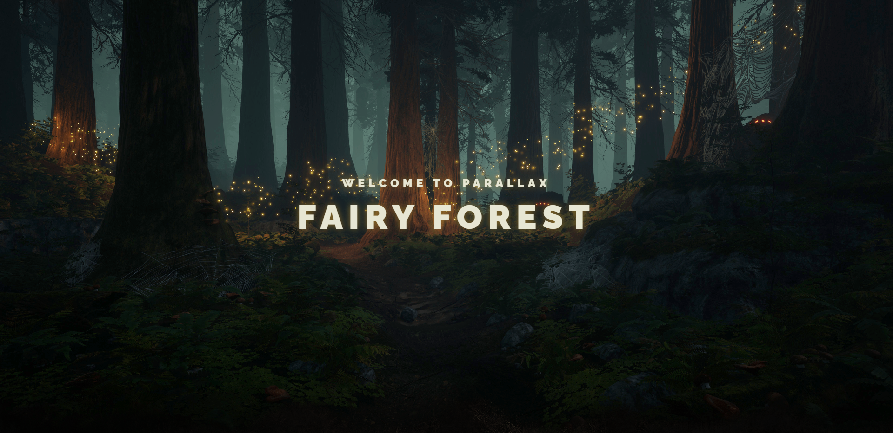

# Parallax Effect Website
Welcome to my Parallax Effect Website 👋, created following the tutorial by WebDesignMaster. This project showcases an amazing parallax scrolling effect and a visually captivating multi-layered structure.

## Features
- Parallax Scrolling: The background and elements on the page move at different speeds as you scroll, creating a dynamic and engaging 3D effect.
- Layered Design: The website incorporates a unique structure with multiple layers, adding depth and dimension to the visual experience.
- Responsive Layout: The design is fully responsive, ensuring a seamless user experience across various devices and screen sizes.
## Technologies Used
- HTML5: For the structure and content.
- CSS3: To create the stunning visual effects, including parallax and responsive design.
- JavaScript: For interactive elements and smooth scrolling.
## How to Use
Simply open the github-pages link in the deployments section on the right.

## Acknowledgments
Thanks to WebDesignMaster for their clear and comprehensive tutorial, which made this project possible.

